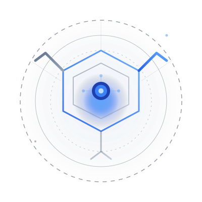

<p align="center">
  
</p>

<h1 align="center">KRIZAKA</h1>

<p align="center">
  <code>[ COGNITIVE SYSTEMS // AUTONOMOUS MULTI-AGENT LAYER ]</code>
</p>

---

## Overview

`krizaka-com` is the **public Next.js site** for Krizaka and its flagship
product, **Orasaka**. It presents the product, the documentation, and a set of
**code-driven, interactive visualizations** of the Orasaka architecture and
cognitive pipeline. Everything that describes the engine is **generated from the
Orasaka source** — the site never hand-maintains architecture facts.

## Tech stack

- **Next.js (App Router)** + React + TypeScript — static-first, server components.
- **Tailwind CSS v4** with a single `--kz-*` design-token system (dark + light).
- **react-three-fiber / drei / three** — the interactive 3D architecture scene.
- **@xyflow/react** (React Flow) — the 2D interceptor-pipeline mesh.
- **next-mdx-remote · gray-matter · remark/rehype** — markdown docs rendering.
- **framer-motion**, **lucide-react**, **mermaid** (print fallback only).

## How the site is generated (content & data flow)

The site is the **read side**; Orasaka (`products/orasaka`) is the source of truth.

```
products/orasaka  ── orasaka docs build ──▶  docs/ (curated) + docs/_generated/ (from code)
                  ── orasaka docs sync  ──▶  krizaka-com/orasaka-content/docs/   (markdown)
                                          └▶  krizaka-com/app/data/architecture.json (3D model)

krizaka-com:
  lib/docs-manifest.ts   publication allow-list — which synced docs are public,
                         with curated title / category / order / audience / intro.
  lib/docs.ts            reads orasaka-content/docs, gates by the manifest, renders MDX.
  app/products/orasaka/[category]/[slug]/page.tsx   the rendered doc pages.
  app/data/architecture.json   →  ArchitectureScene3D (the 3D module graph).
  next build             →  the static public site.
```

So to refresh the published content after an Orasaka change: run
`orasaka docs sync` from `products/orasaka`, then rebuild the site.

## Visualizations

All schemas are **theme-aware (dark + light)** and reduced-motion safe, keyed off
the `--kz-accent` brand identity:

| Component | What it renders | Tech |
|:---|:---|:---|
| `app/components/ArchitectureScene3D.tsx` | The module graph from `app/data/architecture.json` — layered bands, ports, dependency edges, glow + contact shadows. | react-three-fiber |
| `app/components/demos/InterceptorMesh.tsx` (+ `HexNode`, `CustomEdge`) | The 15-stage cognitive interceptor pipeline with per-phase identity and a live inspector. | React Flow |
| `app/components/illustrations/PipelineMesh.tsx` | The pipeline as an animated hexagonal SVG mesh. | SVG + CSS |

## Theming

One token system in `app/globals.css`: dark tokens on `:root`, light overrides on
`html.light`, toggled by `app/components/ThemeProvider.tsx` (persisted in
`localStorage` as `kz-theme`). `color-scheme` is pinned to the active theme so
scrollbars, form controls and third-party CSS follow it. Components read
`var(--kz-*)` only — no hard-coded colors.

## Develop

```bash
npm install
npm run dev      # http://localhost:3000
npm run build    # production build (verify before commit)
npm run start    # serve the production build
npm run lint     # eslint
```

See [`AGENTS.md`](AGENTS.md) for the governance rules (tokens, theming,
generated-vs-curated content, visualization conventions).
