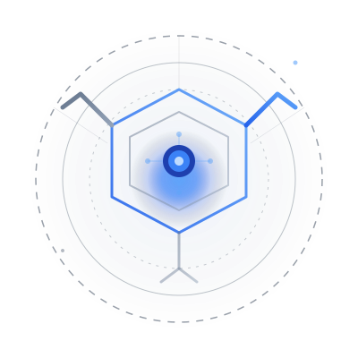

<p align="center">
  
</p>

<h1 align="center">krizaka-com</h1>

<p align="center"><strong>Public Next.js site for Krizaka &amp; its flagship products Orazaka &amp; Orochia.</strong></p>

<p align="center">
  
  <a href="https://github.com/krizaka/orazaka"></a>
  <a href="https://github.com/krizaka/orochia"></a>
  <a href="https://github.com/krizaka"></a>
  
</p>

---

Static-first marketing + documentation site (Next.js App Router, React 19, TypeScript).
The **read side**: architecture/doc facts are generated from the Orazaka engine, never
hand-authored here. Governance contract: [`AGENTS.md`](AGENTS.md).

## Stack

Next.js 16 (App Router, SSG) · React 19 · TypeScript · Tailwind v4 + a `var(--kz-*)`
token system · React Three Fiber/Three.js (3D) · `@xyflow/react` (pipeline graphs) ·
`next-mdx-remote` (docs) · `framer-motion`.

## Where things live

| Path | Role |
|---|---|
| `app/[locale]/` | All routes; `[locale]` is `fr` (Québec) or `en`. `layout.tsx` wires fonts, theme, i18n, the sitewide JSON-LD graph and base metadata. |
| `app/components/` | UI. Big ones: `TopNavBar`, `EngineShowcaseSection`, `ArchitectureScene3D` (3D), `Mermaid`, `MdxComponents`, `DemosGallery`. |
| `app/robots.ts` · `app/sitemap.ts` · `app/manifest.ts` | SEO route handlers. |
| `app/data/architecture.json` | **Generated** module graph + Orazaka repository map (read-only). |
| `proxy.ts` | Edge middleware (Next 16 name): no-locale URL → `/fr` or `/en` by `Accept-Language`, sticky `NEXT_LOCALE` cookie. |
| `next.config.ts` | Security headers, AVIF/WebP, cache policy. |
| `lib/seo.ts` | `localizedMetadata()` + `buildAlternates()` — per-page title/description/canonical/hreflang. |
| `lib/structured-data.ts` | JSON-LD `@graph` builders (Organization · WebSite · SoftwareApplication, Breadcrumb, FAQ). |
| `lib/site.ts` | External identity (SITE_URL, GitHub, version) — single source. |
| `lib/i18n.ts` | Translation dictionary (large; FR/EN). |
| `lib/docs.ts` · `lib/docs-manifest.ts` | Reads `orazaka-content/docs`, gated by the publish allow-list. |
| `lib/{use-cases,packages,architecture-mesh,pipeline-mesh}-data.ts` | Page/visualization data. |
| `orazaka-content/docs/` | **Synced** markdown from Orazaka (read-only). |

## Content sync (read-only data)

```
products/orazaka (workspace)  ──  orazaka docs sync  ──▶  orazaka-content/docs/   (markdown)
                                                      └▶  app/data/architecture.json (3D model + repository map)
```

`products/orazaka` is a local clone of the **Orazaka workspace** ([`krizaka/orazaka`](https://github.com/krizaka/orazaka))
with every component repository cloned inside it (`node scripts/workspace.mjs clone`). It is ignored
by this repository's git.

## Orazaka repositories

Orazaka is published as **one repository per component** in the [krizaka](https://github.com/krizaka)
organisation; the site renders the list from the generated `architecture.json`
(`/products/orazaka/architecture#repositories`).

| Layer | Repositories |
|---|---|
| Workspace | [orazaka](https://github.com/krizaka/orazaka) — governance, manifest, infra, e2e, docs |
| Foundation | [orazaka-build](https://github.com/krizaka/orazaka-build) · [orazaka-contracts](https://github.com/krizaka/orazaka-contracts) · [orazaka-edge](https://github.com/krizaka/orazaka-edge) · [orazaka-ui-kit](https://github.com/krizaka/orazaka-ui-kit) |
| Domain services | [orazaka-users](https://github.com/krizaka/orazaka-users) · [orazaka-notifications](https://github.com/krizaka/orazaka-notifications) · [orazaka-billing](https://github.com/krizaka/orazaka-billing) |
| AI engine | [orazaka-ai-engine](https://github.com/krizaka/orazaka-ai-engine) · [orazaka-studio](https://github.com/krizaka/orazaka-studio) · [orazaka-conversation-service](https://github.com/krizaka/orazaka-conversation-service) · [orazaka-job-service](https://github.com/krizaka/orazaka-job-service) · [orazaka-knowledge-service](https://github.com/krizaka/orazaka-knowledge-service) · [orazaka-automation-service](https://github.com/krizaka/orazaka-automation-service) · [orazaka-worker-media](https://github.com/krizaka/orazaka-worker-media) |
| Apps & content | [orazaka-web-client](https://github.com/krizaka/orazaka-web-client) · [orazaka-web-admin](https://github.com/krizaka/orazaka-web-admin) · [orazaka-mobile-client](https://github.com/krizaka/orazaka-mobile-client) · [orazaka-cli](https://github.com/krizaka/orazaka-cli) · [orazaka-packs](https://github.com/krizaka/orazaka-packs) |

## Orochia repositories

Orochia is published as a dedicated 3-tier creator & streaming platform in the [krizaka](https://github.com/krizaka) organisation; the architecture is code-generated in `app/data/orochia-architecture.json` and presented at `/products/orochia`.

| Layer / App | Repository | Port | Description |
|---|---|---|---|
| Consumer Web | [orochia](https://github.com/krizaka/orochia) | `3000` | 4K HLS player, direct Bunny Tus ingest, PostgreSQL scrypt auth, paywalls |
| Control Plane | [orochia-admin](https://github.com/krizaka/orochia-admin) | `3001` | 18 U.S.C. § 2257 federal compliance vault, instant CDN purge, treasury rake |
| Design System | [orochia-design-system](https://github.com/krizaka/orochia-design-system) | `3002` | Obsidian Velvet Noir tokens, interactive components & live showcase |

Never hand-edit `orazaka-content/` or `app/data/`. To publish a synced doc, add an entry
to [`lib/docs-manifest.ts`](lib/docs-manifest.ts) (curated title/category/order/audience).

## Conventions

- **SEO**: every page sets `alternates`/title/description via `localizedMetadata(locale, { path, en, fr })` from `lib/seo`. The bare `/` and any unprefixed path 307-redirect (via `proxy.ts`), so canonicals are always the localized self URL.
- **Theming**: `var(--kz-*)` tokens only — dark on `:root`, light on `html.light`, persisted as `kz-theme`. **Verify every new view in both themes.** No hard-coded hex / Tailwind color literals for surfaces.
- **Reduced motion**: honor `prefers-reduced-motion` (disable 3D orbits, entrance animations).
- **3D scenes**: client-only — `dynamic(() => import(...), { ssr: false })` with a themed fallback.

## ⚠️ Gotcha: the unlayered CSS reset

`app/globals.css` has an **unlayered** `* { margin: 0; padding: 0 }` reset that overrides
Tailwind's *layered* spacing utilities (`mx-auto`, `px-*`, `pt-*` silently do nothing for
layout). That's why inner pages use **inline `style`** for container width/padding. Use
inline styles (or non-spacing classes) for page layout until the reset is moved into a
`@layer`.

## Contact form

`/contact`, the home page and every product page end with a contact form that posts to
`app/api/contact`. Configure at least one delivery channel in the hosting environment (Vercel →
Settings → Environment Variables); without one the endpoint answers `503` instead of pretending:

| Variable | Purpose |
| :--- | :--- |
| `RESEND_API_KEY`, `CONTACT_TO_EMAIL` | e-mail through the [Resend](https://resend.com) API (comma-separated recipients) |
| `CONTACT_FROM_EMAIL` | sender, on a domain verified in Resend (default `Krizaka <contact@krizaka.com>`) |
| `CONTACT_WEBHOOK_URL` | JSON POST to Slack, Discord or any relay (`text`, `content` and structured `contact` fields) |

## Develop

```bash
npm install
npm run dev      # http://localhost:3000  (→ redirects to /fr or /en)
npm run lint
npm run build    # SSG build — run before pushing
npm run start
```
