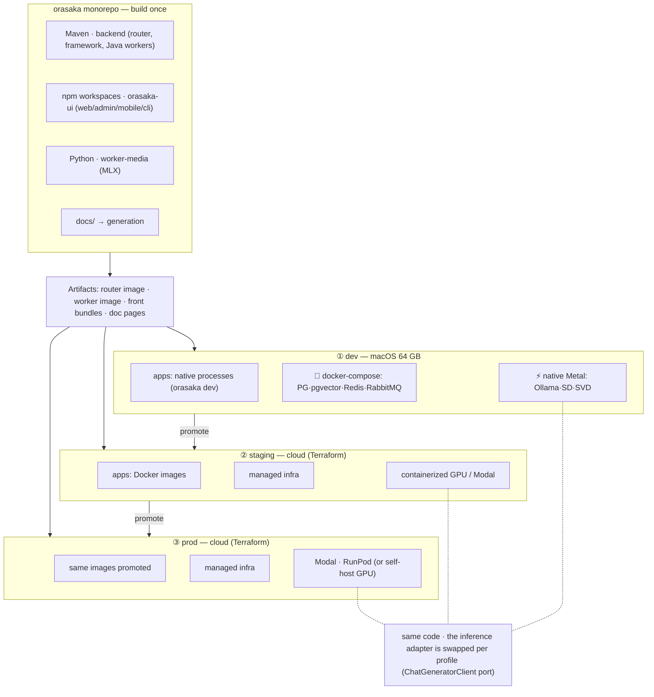
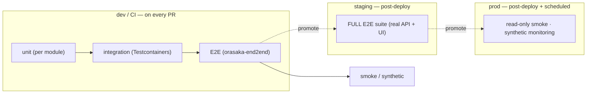
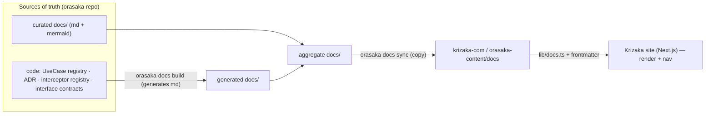
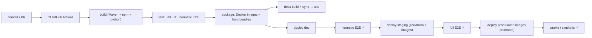

# Orasaka — DevX, environments & lifecycle

> Operational closure of the vision: **repo organization**, **dev environment**, **E2E tests across 3 environments**, **docs generation** to the Krizaka site, and **deployment**.
> Dev hardware target: **macOS 64 GB** · Docker for infra · AI runtimes native (Metal). IDEs: **IntelliJ** (Java backend) + **VSCode** (TS / Python frontends). Single orchestrator: **the `orasaka` CLI**.

> [!IMPORTANT]
> **Current phase = 100% LOCAL.** No CI, no cloud deployment. Everything (build, run, test, docs) runs on the dev machine.
> The **staging / prod / CI** sections below describe the **deferred target**: they are **not** implemented until explicitly requested. What applies today: the **dev** column of the tables, **hermetic E2E** as the quality gate, and `orasaka docs build|sync` run **locally**. Enforceable rule: `.agent/rules/local_dev.md`.

---

## 1. Central principle — "one difference per environment: the config"

The code is **identical** everywhere. What changes from one environment to another is **the configuration and the infrastructure adapter**, never the domain. In particular:

- The **inference runtime** is native macOS in dev (Metal), but **containerized / cloud GPU** in staging/prod. Thanks to hexagonal, it's a simple **adapter swap** behind the `ChatGeneratorClient` port (Ollama localhost in dev; remote GPU endpoint in staging/prod). **"Native local-first" is a DevX optimization, not a prod constraint.**
- *Stateful* infra is `docker-compose` in dev, **Terraform** (managed) in staging/prod.
- Apps are **native processes launched by the CLI** in dev, and **the same Docker images promoted** in staging then prod.

| | **dev** (macOS 64 GB) | **staging** | **prod** |
| :--- | :--- | :--- | :--- |
| Apps (router, worker) | native processes via `orasaka dev` | Docker images | **same images promoted** |
| Infra (PG/pgvector/Redis/RabbitMQ) | local `docker-compose` | Terraform (managed) | Terraform (managed) |
| AI runtime | **native Metal** (Ollama/SD/SVD) | containerized GPU / Modal | Modal · RunPod *(or self-host GPU)* |
| Frontends | dev servers (Next/Expo) | deployed build | deployed build |
| Data | throwaway (seed) | anonymized | real |
| Spring profile | `application-dev.yml` | `application-staging.yml` | `application-prod.yml` |
| Tests | **hermetic** E2E (Testcontainers) | **full E2E suite** post-deploy | **smoke / synthetic** read-only |

---

## 2. Schema — structure & target (build once, promote)



---

## 3. Dev environment

### 3.1 What runs where (macOS 64 GB)

- **Docker** (*stateful* infra only): PostgreSQL+pgvector, Redis, RabbitMQ. Started by `orasaka start`.
- **Native macOS** (Metal): Ollama (chat+embeddings), stable-diffusion.cpp (image), worker-media MLX (video). Never in Docker (otherwise CPU fallback = destroyed DevX).
- **Apps**: router, workers, web-client, web-admin, mobile (Expo) — launched as native processes by `orasaka dev` with color logs.
- 64 GB lets everything run in parallel (Docker infra + 2–3 loaded Ollama models + apps + IDE).

### 3.2 IDE split

| IDE | Scope | Why |
| :--- | :--- | :--- |
| **IntelliJ IDEA** | Java/Maven backend: `orasaka-router`, `orasaka-framework/*`, Java workers | multi-module Maven support, Spring, JVM debugging, ArchUnit |
| **VSCode** | TS frontends (`orasaka-ui/*`), `worker-media` (Python), infra scripts | Next/Expo, ESLint, Pyright, integrated terminal for the CLI |

Both share the repo; **the `orasaka` CLI is the neutral orchestrator** both call. To commit so both IDEs are *turnkey*:

- `.run/` — IntelliJ run configs (Router [dev], Worker [dev], with `SPRING_PROFILES_ACTIVE=dev`).
- `.vscode/{launch,tasks,extensions}.json` — `orasaka dev` tasks, Next/Expo debugging, recommended extensions.

### 3.3 Local cycle (inner loop)

```bash
orasaka install      # detect HW/prereqs (Java 21, Node 24+, Docker, Ollama), generate .env
orasaka start        # start the Docker infra + check native Ollama
orasaka models pull  # pull the required Ollama models
orasaka dev          # spawn router + workers + web + admin + mobile (color logs)
#   variants: orasaka dev --only web,core   |   --only mobile
orasaka onboard      # validate a clone-and-run (prereqs → build → M2M → runtime)
```

---

## 4. E2E tests across dev / staging / prod

A 4-level pyramid, driven by `orasaka-end2end` (matrix: httpyac API → Vitest CLI → Playwright UI → 4-tier validation).



| Level | Where | What | Data |
| :--- | :--- | :--- | :--- |
| Unit | dev + CI (every PR) | pure logic, mappers, records | none |
| Integration | dev + CI | repos/adapters via **Testcontainers** (reused singleton) | ephemeral |
| Hermetic E2E | dev + CI | end-to-end journeys, throwaway infra | seed |
| Full E2E | **staging**, post-deploy | **real** deployed API + UI | anonymized |
| Smoke / synthetic | **prod**, post-deploy + cron | non-destructive probes, read-only | real |

Commands: `orasaka test unit | it | e2e`. In CI, hermetic E2E gates the merge; full E2E gates promotion to prod.

---

## 5. Docs generation → Krizaka informational site

The docs are **generated then injected** into the org's Next.js site (already in place: `lib/docs.ts` reads `orasaka-content/docs`, frontmatter `title/description/category/order`).



- **`orasaka docs build`**: generates from the code **(a)** markdown (product catalog from the `UseCaseDescriptor`s, ADR ledger, interceptor registry, interface contracts) **and (b)** a **structured model** `docs/_generated/architecture.json` (modules, ports, dependencies, pipeline, messaging) extracted by ArchUnit/annotation scan. `--check` fails the build if the model is stale.
- **`orasaka docs sync`**: copies `products/orasaka/docs` + `docs/_generated/*` → `orasaka-content/docs` (consumed by the site).
- **Schemas = 3D ultra-design components**: on the Krizaka site, architecture views are rendered by **interactive 3D components** (React Three Fiber / Three.js + drei) driven by `architecture.json` — cinematic dark-mode, depth, zoom/rotate/hover. Mermaid is only a print fallback. *(Local phase: run locally, not in CI.)*
- The **frontmatter** (already present on our docs) drives navigation and ordering on the site. **Generated docs are never hand-edited.**

---

## 6. Deployment

### 6.1 Strategy

**Build once, promote the same artifact.** One image per app (`orasaka-router`, `orasaka-worker-*`), built once in CI, then **promoted** dev → staging → prod without rebuild; only the **per-profile config** changes. Infra is **declarative** (Terraform, per-env workspaces). Frontends are deployed as bundles (Next build / Expo).

### 6.2 Pipeline



### 6.3 What gets deployed

| Component | dev | staging / prod |
| :--- | :--- | :--- |
| `orasaka-router` | native process | Docker image (Terraform) |
| `orasaka-worker-integrations` | native process | Docker image |
| `orasaka-worker-media` | native macOS (MLX) | **cloud GPU** (Modal/RunPod) or GPU container |
| Frontends (web/admin) | dev server | deployed bundle (Next) |
| Infra (PG/Redis/MQ) | docker-compose | managed Terraform |
| Inference (Ollama/SD/SVD) | native Metal | remote GPU endpoint (adapter swap) |

Command: `orasaka deploy --env <dev|staging|prod>` (wraps Terraform + image push + migrations).

> **Open decision**: the cloud provider (router/infra) and the GPU target (Modal vs RunPod vs self-host) remain to be settled. Terraform (`infra/terraform`) and the compute nodes (`infra/compute-nodes`: `modal_app.py`, `runpod.toml`) are already bootstrapped.

---

## 7. `orasaka` CLI reference (single orchestrator)

| Command | Role | Env |
| :--- | :--- | :--- |
| `orasaka install` | detect HW/prereqs, generate `.env` | dev |
| `orasaka start` | Docker infra (PG/pgvector/Redis/RabbitMQ) + check native Ollama | dev |
| `orasaka models pull` | pull the Ollama models | dev |
| `orasaka dev [--only …]` | spawn apps natively, color logs | dev |
| `orasaka onboard` | validate clone-and-run (timeout-guarded) | dev / CI |
| `orasaka test [unit\|it\|e2e]` | run the test tiers | dev / CI |
| `orasaka docs [build\|sync]` | generate + sync docs to the site | CI |
| `orasaka deploy --env <…>` | deploy (Terraform + images + migrations) | CI |

---

## 8. Decision summary (lifecycle)

| # | Topic | Decision |
| :-: | :--- | :--- |
| 1 | Config vs code | one difference per env = the **config**; the code is identical |
| 2 | Inference | native Metal in dev; **adapter swap** to cloud GPU in staging/prod |
| 3 | Infra | `docker-compose` in dev; **Terraform** (workspaces) in staging/prod |
| 4 | Artifacts | **build once, promote**; same images dev→staging→prod |
| 5 | IDE | IntelliJ (backend) + VSCode (front/python), neutral CLI |
| 6 | E2E | hermetic in dev/CI; full in staging; smoke in prod |
| 7 | Docs | generated from code + `orasaka docs sync` → Krizaka site |
| 8 | Orchestration | **the `orasaka` CLI** is the single entry point for the whole cycle |

---

*Written on 2026-06-08 — environments and lifecycle strategy (Claude Code handoff).*
