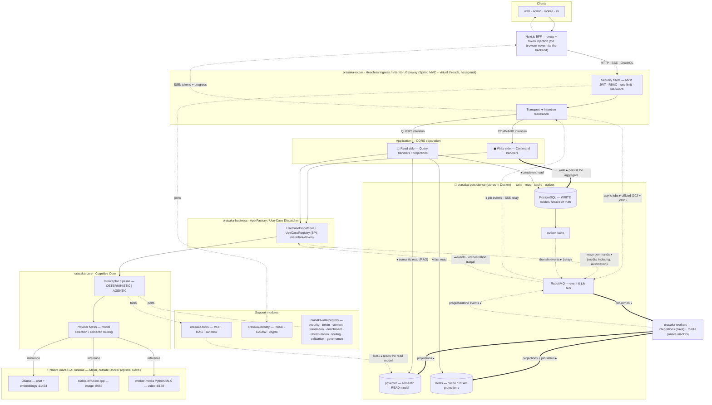
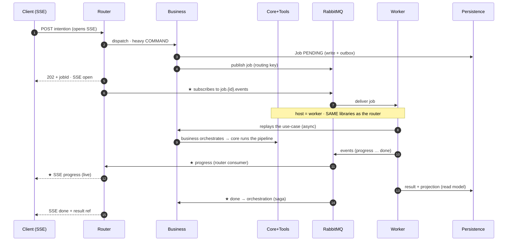
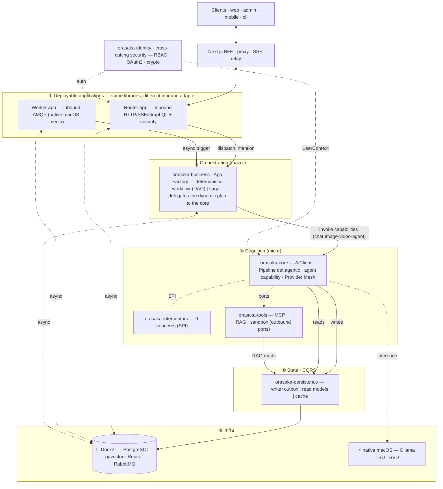

# Orasaka — Target architecture vision

> A **vision** document, not an as-is audit. It describes what the project **must become** before implementation.
> See [`VISION_ARCHITECTURE.md`](VISION_ARCHITECTURE.md) for the existing system.
> **Constraints**: we stay on a single `init project` commit · we keep hexagonal · local-first DevX (AI native on macOS, stateful infra in Docker).

---

## 1. Guiding principles

1. **Intention-driven, not query-driven.** The system's entry unit is no longer a technical "query" but an **`Intention`**: what the actor wants to accomplish. The router translates transport (HTTP/SSE/GraphQL) into an `Intention`, the business layer dispatches it to a use case, and the core executes it. This ubiquitous-language shift is the pivot of the whole architecture (see §4).
2. **Hexagonal everywhere** (Ports & Adapters), enforced by ArchUnit at build time. The domain knows nothing about the web, the database, or the security context.
3. **App Factory.** The business layer is a product factory: adding a new product/vertical (e.g. CinePulse) = declaring a `UseCase` + its personas + its metadata, **without touching** the core or the router.
4. **CQRS — read/write separation.** Commands (which change state) and queries (which read) take distinct paths, distinct models, and distinct stores. This is the key to scalability and readability.
5. **Local-first DevX.** AI runtimes (Ollama, image, video) run **natively on macOS (Metal)**, never in Docker. Only *stateful* infra (PostgreSQL/pgvector, Redis, RabbitMQ) lives in Docker.
6. **Dynamism preserved.** The pipeline keeps its two modes: `DETERMINISTIC` (DB-driven order) and `AGENTIC` (LLM intent classification), hot-switchable.
7. **Auto-generated documentation** from the source of truth (`UseCase` metadata, ADRs, interceptor registry) and injected into the parent project (Krizaka site) — a pattern already in place, to be strengthened (§10).

---

## 2. The single high-level schema (with read/write separation)



### Schema description

The flow reads top to bottom. **Clients** only talk to the **Next.js BFF**, which injects the token and relays to the **router**. The router does two things, and only two: it **enforces security** (JWT, RBAC, rate-limit, kill-switch) and it **translates transport into an `Intention`** — it contains no business logic.

Each `Intention` is typed **COMMAND** (it will change state) or **QUERY** (it only reads): that is the **CQRS** boundary. Both sides go through the **`UseCaseDispatcher`** of the **business** layer (the App Factory), which resolves the intention to the right use case, then delegates to the **core** — the cognitive engine, its **interceptor pipeline**, and its **Provider Mesh**.

**Read/write separation** is materialized by two disjoint paths:

- **Write (thick line ▸)**: the command persists the aggregate in **PostgreSQL** (the single source of truth), which emits **domain events** to **RabbitMQ**; the **workers** consume those events and **asynchronously** build the read **projections** (in pgvector for semantic, in Redis for hot).
- **Read (thin line ◂)**: the query is served from the **read models** — Redis (fast projections), pgvector (semantic RAG), or PostgreSQL (strongly consistent read) — **without ever mutating** state.

Finally, the **execution boundary**: anything that is *AI inference* (Ollama, image, video) runs **natively on macOS** to leverage Metal; anything *stateful* (Postgres/pgvector, Redis, RabbitMQ) runs in **Docker**. This line is intentional: Docker on macOS does not access the GPU properly, which would destroy DevX.

### Async messaging — RabbitMQ as a decoupling buffer

RabbitMQ does not only talk to the database: it is the **buffer that decouples the synchronous path from heavy work**. Three producers publish to it, and only workers consume — no one calls a worker directly (producer/consumer coupling broken):

| Producer | Publishes | Why through the broker |
| :--- | :--- | :--- |
| **router** | *async jobs* (the router judges a request heavy → returns `202 + jobId` instead of blocking) | offloads the request thread, immediate response |
| **business / core** | *heavy commands* (media generation, RAG indexing, automation) | the synchronous path never carries a multi-second/minute task |
| **persistence (write)** | *domain events* via **transactional outbox** (written in the same transaction as the aggregate, then relayed) | guaranteed atomicity, zero dual-write, zero lost event |

On the consumption side, the **workers** (Java integrations + native macOS media) process, **build the projections** (pgvector/Redis), and **publish the job status**. The client retrieves the result **through the read side** (status polling/SSE), never via a direct broker return.

**What does NOT go through RabbitMQ**: interactive chat streaming stays **synchronous** (token-by-token SSE on a virtual thread). Routing a real-time stream through a broker would add latency with no benefit. Rule: *broker = heavy / deferred / event-driven; synchronous = low-latency interactive.*

### The router is also a *consumer* — SSE relay

For an async intention, the user wants to follow **live** what is happening for THEIR intention. So the router is not only a producer: it **subscribes** to the job's events (`job.{id}.events`) and **relays them to the client over SSE**. Nothing blocks, and the client gets a live stream.

- **router** = producer (publishes the job) **and** consumer (relays the job's events to the client over SSE).
- **business** = producer **and** consumer: it reacts to domain events to **orchestrate** multi-step workflows (saga / choreography) — e.g. on `scene.rendered`, it triggers the next step.
- **workers** = consumers of commands, producers of progress/completion events.

> Multi-instance: the SSE connection lives on a given router node; each instance subscribes via an **exclusive queue** bound to the routing keys of the jobs whose SSE stream it holds. In local single-node, this is trivial.



### Where are `persistence` and `tools`

- **`orasaka-persistence`** is the module that **owns** the stores: the write model (PostgreSQL + outbox table), the read models (pgvector/Redis projections), and the cache. In the high-level schema, the PG/pgvector/Redis cylinders **are** that module; Docker infra is only its hosting.
- **`orasaka-tools`** (MCP · RAG · sandbox) is called **by the core** (via the `enrichment`/`tooling` interceptors) as outbound capabilities: it reads the semantic read model (pgvector) for RAG and reaches MCP servers / the web. It runs **inside the worker** for a heavy intention, or **inside the synchronous core** for an interactive intention.

### Layer ≠ process — the worker is a *host*, not an orchestrator

This is the confusing point in the sequence. **The worker orchestrates nothing.** `business`, `core`, `interceptors`, `tools` are **libraries** (Maven modules), not services. They are packaged into **two deployable apps** that embed *the same libraries*:

| | **router app** (synchronous) | **worker app** (asynchronous) |
| :--- | :--- | :--- |
| Inbound adapter (trigger) | HTTP · SSE · GraphQL | AMQP listener |
| Downstream (identical) | **business orchestrates → core runs the pipeline → tools** | **business orchestrates → core runs the pipeline → tools** |

The **only** difference between the two is the **inbound adapter**. So "the worker runs the pipeline" means: *the core's pipeline runs in the worker process*. Orchestration stays **business**, in both hosts — never the worker itself.

**Offload granularity (to choose per use-case):**

- **Thin** — heavy terminal compute (video/image render, transcription): the pipeline runs **synchronously** in the router, and only the **GPU primitive** is offloaded. The worker is a simple *model runner*.
- **Full** — long autonomous workflow (multi-turn agent, batch indexing): the whole use-case (business + core) runs **in the worker**, event-driven. The job itself is the long-running thing.

**What is the advantage of offloading to a worker (rather than doing everything in the router)?**

1. **Isolation / offload** — a multi-minute task does not occupy the process that serves requests; the router stays responsive and cannot be exhausted by a runaway job.
2. **Independent scaling** — N workers (GPU/CPU-heavy) sized separately from the router (I/O, connections). On Apple Silicon: 1 router + several media workers.
3. **Resilience** — *at-least-once* delivery + retry + DLQ: a worker crash ⇒ the message is redelivered, the job resumes. A failed synchronous call would simply be lost.
4. **Back-pressure** — a burst of heavy tasks **queues up** instead of saturating the system; workers drain at their own pace.
5. **Native process boundary** — the media worker is **native macOS (MLX/Metal)**, isolated from the router's JVM. The queue is the natural join.
6. **Zero duplication** — same libraries: async execution is "free" code-wise, only the trigger changes.

---

## 3. Role of each layer (clarification)

| Layer | Single role | Knows | Does NOT know |
| :--- | :--- | :--- | :--- |
| **orasaka-router** | *Headless Ingress.* Translates transport → `Intention`, enforces security & streaming. No business logic. | HTTP, SSE, GraphQL, JWT | use-cases, AI models |
| **orasaka-business** | *App Factory.* Resolves an `Intention` to a `UseCase` and orchestrates capability composition. Extensible without touching the rest. | use-cases, personas | transport, providers |
| **orasaka-core** | *Cognitive Core.* Primitive capabilities (chat/image/audio/video), interceptor pipeline, Provider Mesh, model routing, vector routines. Stateless, web/DB-agnostic. | Spring AI, capabilities | use-cases, web, database |
| **orasaka-interceptors** | *Cross-cutting filters* of the pipeline (one module, packages by concern). | the `PromptContext` | business orchestration |
| **orasaka-tools** | *The hands.* Outbound adapters: MCP, RAG, web search, sandboxed execution. | external systems | business logic |
| **orasaka-identity** | *Security bounded context.* Users, credentials, RBAC, OAuth2, crypto. | identity | AI, transport |
| **orasaka-persistence** | *State.* Write models (aggregates) and read models (projections) + cache. | JPA, SQL, Redis | business logic |
| **orasaka-workers** | *Asynchronous.* Consumes events, builds projections, runs heavy jobs (native media). | AMQP, projections | synchronous transport |

> **Decision — `orasaka-identity` is kept** as a full module (it is a *bounded context*, not a mere aspect). The example tree omitted it; we keep it. The per-request **enforcement** of security lives in `interceptors/security` + the router filters, which rely on the **ports** of identity.

### Layered view (modules & dependencies)

Structural view complementing the flow schema of §2: it shows the **modules**, their **separation**, and the **dependency direction** (hexagonal rule: everything points toward the core; `core` depends on no outer layer).



---

## 4. The `Query` ➜ `Intention` shift

This is the most structuring ubiquitous-language change.

An **`Intention`** is an immutable domain object describing *what the actor wants to accomplish*:

```text
Intention {
  actor      : who (resolved identity + RBAC)
  type       : COMMAND | QUERY            // CQRS pivot
  capability : CHAT | IMAGE | AUDIO | VIDEO | AGENT | ...
  goal       : business intent (e.g. "generate a cinematic teaser")
  payload    : input data (validated record)
  context    : session, preferences, environment signals
}
```

Consequences:

- The **router** does not "receive a request": it **captures an intention** from a transport and normalizes it. Its name (*router* = intention router) makes full sense.
- **business** is an **intention dispatcher**: `Intention → UseCase`.
- The **core** executes an intention by composing capabilities, through the pipeline.
- The interceptor pipeline reasons over the `Intention` (classification, model routing, enrichment), not over a raw string.
- CQRS becomes natural: the intention's `type` decides the path (write vs read).

---

## 5. `orasaka-business` as App Factory

### Goal

Adding a new product must require **minimal effort**: implement a contract, declare metadata, drop personas. The registry discovers the rest.

### Internal split (packages)

```
com.orasaka.business
├── api/            # CONTRACTS — Intention, UseCase, UseCaseDescriptor, Capability (inbound ports), DTO
├── core/           # DISPATCH — UseCaseDispatcher, UseCaseRegistry, Intention→UseCase resolution, capability composition
├── usecases/       # IMPLEMENTATIONS — one self-contained package per use case (chat-assistant, image-studio, cine-video, agent-runner, …)
├── personas/       # markdown prompt library (loaded via ResourceLoader)
└── infrastructure/ # ADAPTERS — descriptor loading (config/DB), persona loader, metadata
```

### Factory mechanics

- `UseCase` is an **SPI** (inbound interface); each use case implements it.
- `UseCaseRegistry` **auto-discovers** them (component scan / `ServiceLoader`) and indexes them by `UseCaseDescriptor` (metadata: target capability, personas, policies, routing mode).
- **Metadata-driven** bootstrap (extends ADR-027): descriptors can come from config or a table.
- **Adding a product** = (1) a package under `usecases/` implementing `UseCase`, (2) a `UseCaseDescriptor`, (3) markdown personas. Zero change to `core`/`router`.

Resolution flow (textual): `Intention → UseCaseRegistry → (match descriptor) → target UseCase → composes the core capabilities (chat/image/…)`.

### Orchestration: three scopes — and where the intelligence lives

Do not conflate two "orchestrations". There are in fact **three**, at different levels, with different owners:

| Scope | Owner | Deterministic | Dynamic / agentic |
| :--- | :--- | :--- | :--- |
| **Pipeline** — *1 inference* | `core` | DB-driven order (`pipeline_interceptor_config`) | `RouterInterceptor` classifies the intention → picks route/model |
| **Agent loop** — *cognitive steps of a task* | `core` (`agent` capability) | — | *plan → act (tool) → observe* loop, LLM-driven |
| **Workflow / use-case** — *macro, multi-capability, saga* | `business` | DAG declared in the `UseCaseDescriptor` | **delegates** planning to the core's `agent` capability, then runs the plan |

**So, precisely — answer to "does business do both dynamic AND non-dynamic?"**:

- Yes for **macro** orchestration (workflow): `business` drives it, whether **declarative** (DAG fixed in the descriptor) or **dynamic** (plan generated at runtime).
- **BUT the intelligence that determines the steps does not live in `business`.** Business stays **thin coordination** (ADR-017, anemic services). For the dynamic case, it **delegates** planning to a **core capability** (an LLM call via the pipeline), gets back a plan, then runs / iterates it.
- The `DETERMINISTIC | AGENTIC` mode of §4 is **a different thing**: it concerns the **composition of the pipeline for ONE inference**, not the workflow. Do not mix "dynamic pipeline" (core, micro) with "dynamic workflow" (business delegates to the core, macro).

**Why the intelligence in `core` and not in `business`?**

- The agentic part (*plan-act-observe* loop) is intimately coupled to the model, the tools, and the pipeline — `core` territory. An "agent" becomes **a core capability just like chat/image/video** (`AiClient.agent(...)`), which `business` invokes like the others.
- `business` stays thin, deterministic, and testable: it coordinates capabilities, it embeds no LLM logic.

> Rejected alternative: hosting the agent loop **in business**. Faster to wire up initially, but it leaks cognition (prompts, tools, model) into the orchestration layer and breaks hexagonal purity. We keep the intelligence in `core`.

---

## 6. `orasaka-interceptors` — single module, fine-grained packaging

We **collapse the 7 Maven submodules** into **a single module**, with an **internal split by concern**:

```
com.orasaka.interceptors
├── security/      ──► SecOpsInterceptor            (RBAC, rate-limit, kill-switch)
├── token/         ──► CostShieldInterceptor        (budget / cloud failover)
├── context/       ──► ContextEnrichmentInterceptor (user + system + env)
├── translation/   ──► LanguageAlignmentInterceptor
├── enrichment/    ──► RagInterceptor, McpInterceptor, MemoryInterceptor
├── reformulation/ ──► RefinerInterceptor, SemanticRouterInterceptor
├── tooling/       ──► ToolInterceptor
├── validation/    ──► MediaInterceptor, ClosedLoopValidationInterceptor
└── governance/    ──► activation-policy engine (predicates)
```

Benefits: a single artifact to version, a single `AutoConfiguration`, boundaries expressed by **package** (not by Maven module), while keeping order and conditional activation driven by `governance`.

### "De-marketing" renames (readability)

| Before | After | Reason |
| :--- | :--- | :--- |
| `QuantumValidationAdvisor` | `ClosedLoopValidationInterceptor` | describes the function (closed loop), not a buzzword |
| `SimDagRouterInterceptor` | `SemanticRouterInterceptor` | semantic routing |
| `ConfigMeshCache` | `PolicyConfigCache` | says what it is |

---

## 7. Naming convention (coherent & dynamic)

| Element | Rule | Example |
| :--- | :--- | :--- |
| Maven module | `orasaka-<bounded-context>` | `orasaka-core` |
| Root package | `com.orasaka.<module>.{domain,application,infrastructure}` | `com.orasaka.business.core` |
| Inbound port | capability/service name (no technical suffix) | `AiClient`, `UseCaseDispatcher`, `IntentionGateway` |
| Outbound port | `<Capability>Client` · `<Thing>Provider` · `<Thing>Repository` | `ChatGeneratorClient`, `ModelCatalogProvider` |
| Adapter | `<Tech><Port>Adapter` | `OllamaChatClientAdapter`, `RabbitUserEventAdapter` |
| Interceptor | `<Concern>Interceptor` (in the `<concern>` package) | `LanguageAlignmentInterceptor` |
| I/O record | explicit suffix | `*Command`, `*Query`, `*Request`, `*Response`, `*Event`, `*Descriptor` |
| Mapper | static helper `*Mapper` | `ChatSessionMapper` |
| Use case | `<Domain><Action>UseCase` | `CinematicVideoUseCase` |

**"Dynamic"** = naming must reflect configurable runtime behavior: components driven by config/DB carry a **functional, neutral** name (not a name tied to a tech or a fad). The two modes `DETERMINISTIC` / `AGENTIC` stay configuration values (`orasaka.core.orchestration.routing.mode`), hot-switchable and overridable per `Intention`.

---

## 8. Decision — Router: Spring MVC + virtual threads (neither SCG nor WebFlux)

**Recommendation: Spring Boot in MVC (servlet) + virtual threads (Loom), hexagonal. No Spring Cloud Gateway, no WebFlux.**

### 8.1 No Spring Cloud Gateway

- The router **is not a dumb L7 proxy**: it hosts rich inbound adapters (GraphQL, SSE, BFF, auth) and the **`Intention` translation**. Spring Cloud Gateway (SCG) is designed for **declarative routing to downstream services**, not for hosting controllers and orchestration.
- Orasaka is a **modular monolith**: `business`, `core`, `tools` are Maven modules **linked in-process**, not microservices behind a gateway.
- **When to reconsider**: the day we split into separately deployed services, we will introduce a dedicated edge gateway (`orasaka-edge`) **in front of** the router.

### 8.2 MVC + virtual threads, not WebFlux

On Java 21, the historical pro-WebFlux argument (non-blocking scalability) falls: **virtual threads** make the blocking model just as scalable, without the reactive complexity.

- **Persistence is blocking (JPA/Hibernate + HikariCP).** WebFlux on an event-loop + blocking JDBC is an **anti-pattern** (you would have to migrate to R2DBC and lose JPA/Hibernate). MVC + Loom embraces blocking natively.
- **ADR-009 is already an MVC + Loom pattern**: "virtual threads + manual `SecurityContext` propagation". With WebFlux you would use the `Reactor Context`, not the thread-local `SecurityContext` — the existing code already leans toward MVC.
- **DevX (the project's priority)**: imperative code, real stack traces, simple debugging. Reactor imposes a cognitive debt (operators, `Context`, async debugging) that is not justified here.
- **Streaming stays possible in MVC**: an MVC controller can return a `Flux`/`SseEmitter`/`ResponseBodyEmitter`; Spring adapts Spring AI's `Flux<ChatResponse>` into an SSE stream. We thus keep token-by-token streaming **without** an end-to-end reactive stack, the blocking work running on virtual threads.
- **Target load**: a self-hosted / local-first product → no fan-out of hundreds of thousands of concurrent long connections that would justify the event-loop.

**When WebFlux would win**: an end-to-end non-blocking stack (R2DBC instead of JPA), very high concurrency of long connections, or a team already expert in Reactor. None of these conditions hold.

> Enable: `spring.threads.virtual.enabled=true` (Spring Boot 3.2+).

---

## 9. CQRS — read/write separation (detail)

| | WRITE side (Command) | READ side (Query) |
| :--- | :--- | :--- |
| Trigger | `Intention` of type `COMMAND` | `Intention` of type `QUERY` |
| Effect | mutates state | **no** mutation |
| Model | JPA aggregates (write model) | denormalized projections (read models) |
| Store | **PostgreSQL** (source of truth) | **Redis** (hot), **pgvector** (semantic), **PG** (consistent) |
| Propagation | publishes **domain events** → RabbitMQ | reads projections built by the workers |
| Consistency | strong | eventual (async projections) |

`orasaka-persistence` split: within each bounded context (`app`, `identity`), packages `command/` (write repositories on aggregates), `query/` (read repositories/projections), `cache/`. An AI `Intention` can **fan out**: **read** enrichment (RAG/memory from the read models) + **write** persistence (store the turn, emit the event).

---

## 10. Auto-generated documentation (injected into the parent)

A pattern **already in place** (the Krizaka site reads `products/orasaka/docs`). We **strengthen** it: generate part of the docs from the **source of truth** rather than writing them by hand —

- `UseCase` registry (App Factory) → "Product catalog" page,
- ADR ledger + interceptor registry → Architecture pages,
- ArchUnit rules → "enforced constraints" section.

Mechanics: a `docs:generate` step (Maven `exec` or a Node script in `scripts/`) emits markdown into `docs/`, then synced to the parent site. The docs thus stay **always aligned** with the code.

---

## 11. Target tree

```
orasaka/
├── docs/                         # auto-generated + curated, consumed by the Krizaka site
├── infra/                        # docker-compose (PG/pgvector, Redis, RabbitMQ) + terraform
│   └── docker-compose.yml        #   (AI runtimes are NOT here → native macOS)
├── orasaka-apps/
│   ├── orasaka-router/           # Headless Ingress / Intention Gateway (Spring MVC + virtual threads)
│   ├── orasaka-ui/
│   │   ├── orasaka-web-client/
│   │   ├── orasaka-web-admin/
│   │   ├── orasaka-mobile-client/
│   │   ├── orasaka-cli/
│   │   └── orasaka-shared/
│   └── orasaka-workers/
│       ├── orasaka-worker-integrations/
│       └── orasaka-worker-media/ # native macOS (Python/MLX)
└── orasaka-framework/
    ├── orasaka-business/         # App Factory — api / core / usecases / personas / infrastructure
    ├── orasaka-core/             # Cognitive Core / Provider Mesh
    ├── orasaka-interceptors/     # SINGLE MODULE — packages: security/token/context/translation/
    │                             #   enrichment/reformulation/tooling/validation/governance
    ├── orasaka-identity/         # security bounded context (KEPT)
    ├── orasaka-persistence/      # command/ + query/ + cache  (CQRS)
    └── orasaka-tools/            # MCP / RAG / sandbox
```

---

## 12. Decision summary

| # | Topic | Decision |
| :-: | :--- | :--- |
| 1 | Entry concept | `Intention` (typed COMMAND/QUERY) replaces `Query` |
| 2 | Business | Extensible App Factory (`api`/`core`/`usecases`/`personas`) |
| 3 | Interceptors | 1 module, fine-grained packaging by concern |
| 4 | Naming | unified convention + de-marketing |
| 5 | Router | Spring MVC + virtual threads, hexagonal (neither SCG nor WebFlux) |
| 6 | Routing | keep DETERMINISTIC + AGENTIC, switchable |
| 7 | Persistence | CQRS read/write, PG source of truth, async projections |
| 8 | Identity | kept as a bounded context |
| 9 | AI runtime | native macOS (Metal); Docker = stateful infra only |
| 10 | Docs | auto-generated from code, injected into the parent |
| 11 | Git | a single `init project` commit |

---

*Vision written on 2026-06-08 to serve as the implementation spec (Claude Code handoff).*
