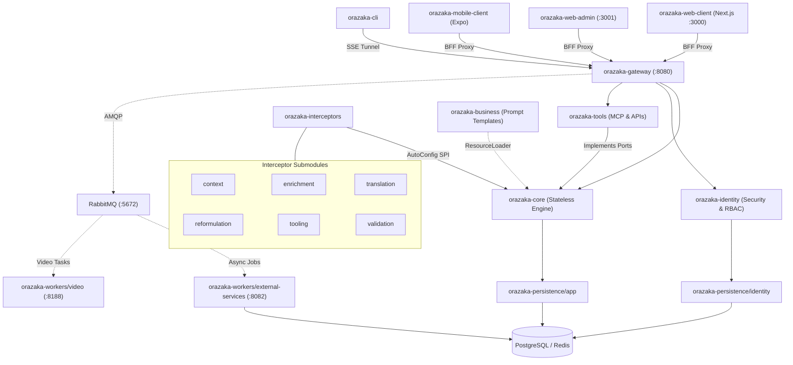

<div align="center">
  
</div>

<h1 align="center">Orazaka — Sovereign AI Orchestration Engine</h1>

<div align="center">
  <strong>Ship enterprise-grade, multi-modal AI products — Chat · Image · Video · Speech · RAG · PromptOps · Tool Calling · MCP — entirely on your own infrastructure.</strong>
</div>

<div align="center">
  
  
  
  
  
  
  <a href="https://sonarcloud.io/project/overview?id=oussamaABID_orazaka"></a>
</div>

---

## Why Orazaka?

Most AI frameworks force a choice: **cloud convenience** or **data sovereignty**. Orazaka eliminates that trade-off.

Built on **Java 21 Virtual Threads**, **Spring AI 1.1**, and a strict **Hexagonal Architecture** enforced at compile time by ArchUnit, Orazaka delivers a production-grade AI orchestration engine that runs entirely on-premise — Apple Silicon, CUDA, or bare metal — with zero cloud dependencies.

> **For Founders**: A single `npx orazaka dev` command spins up your entire sovereign AI stack — Java Gateway, dual Next.js web apps, and a 6-screen mobile client — in parallel. Ship faster than your competitors can provision cloud credits.
>
> **For Engineers**: A clean hexagonal boundary with 15 pipeline interceptors, compile-time governance guards, and a `SovereignWorkflowContext` domain contract that makes extending the engine feel like writing a plugin, not fighting a framework.
>
> **For Enterprise**: Loi 25 / GDPR-compliant by architecture, not by configuration. Every LLM call, every vector query, every model inference stays on your network. ArchUnit tests enforce it. SonarCloud validates it. Testcontainers prove it.

---

## See It in Action

| Cinematic Video Pipeline | High-Fidelity Image Generation |
| :---: | :---: |
| AnimateDiff-Lightning (MPS)<br/><video src="https://github.com/user-attachments/assets/4a643384-358b-4b6d-b02f-1a4c037bbc0b" autoPlay loop muted playsInline controls width="100%"></video> | Stable Diffusion 1.5 (MPS)<br/> |

<div align="center">
  <strong>🔐 Cinematic Login — Frosted Glass Auth with OAuth2 & Credential Flow</strong><br/>
  <sub>Secure entry point with GitHub / Google SSO, glassmorphism design, and animated feedback.</sub><br/><br/>
  
</div>

<div align="center">
  <strong>🚀 One Command to Rule Them All — Full Stack Dev Launch</strong><br/>
  <sub><code>npx orazaka dev</code> spins up Gateway, Web Client, Admin Console & AI engines in parallel.</sub><br/><br/>
  
</div>

<div align="center">
  <strong>🧠 Local AI, Zero Cloud — Streaming Chat Powered by Ollama</strong><br/>
  <sub>Real-time SSE streaming with on-device LLMs. Your data never leaves your machine.</sub><br/><br/>
  
</div>

<details>
<summary>Prompt Transparency (reproducibility configurations)</summary>

- **[Video config](docs/assets/orazaka/output/video/animatediff-lightning/diffusers-pytorch/prompt.md)** — Cinematic cyberpunk sequence parameters
- **[Image config](docs/assets/orazaka/output/image/sd-1.5/stable-diffusion-cpp/prompt.md)** — Photorealistic cityscape generation settings
</details>

---

## Quick Start

Three commands to sovereign AI:

```bash
# 1. Interactive setup — detects hardware, configures topology, generates .env
npx orazaka install

# 2. Launch infrastructure (Postgres, Redis, RabbitMQ, Ollama, LocalAI)
npx orazaka start

# 3. Spin up the entire development stack in parallel
npx orazaka dev
```

> **What `orazaka dev` launches simultaneously:**
> | Prefix | Service | Port |
> |--------|---------|:----:|
> | `CORE` | Java Spring Boot Gateway | 8080 |
> | `WEB-CLIENT` | Next.js 16 Client App | 3000 |
> | `WEB-ADMIN` | SecOps Admin Console | 3001 |
> | `MOBILE` | Expo SDK 53 Mobile App | 8081 |
>
> All processes stream color-coded output with aligned prefixes. `Ctrl+C` gracefully shuts everything down.

**Selective launch** — need the Gateway running in IntelliJ for debugging?

```bash
npx orazaka dev --skip-core       # Launch everything except the Gateway
npx orazaka dev --skip-mobile     # Skip the Expo dev server
```

**npm script shortcuts** (from `orazaka-cli/`):

```bash
npm run check      # Verify tools are installed (non-destructive)
npm run status     # Check which services are running (UP/DOWN)
npm run setup      # Full wizard: tools + topology + .env generation
npm run start:dev  # Launch WEB-CLIENT + WEB-ADMIN (skip core & mobile)
```

---

## Architecture

### System Layer Governance

Orazaka enforces a strict separation between **what** the system must achieve and **how** it executes:

| Layer | Responsibility | Owns | Location |
|:------|:---------------|:-----|:---------|
| **Business** | Declares intent, policies, and domain rules | `SovereignWorkflowContext`, `.md` persona templates, interceptor policy sets | `orazaka-framework/orazaka-business/` |
| **Core** | Executes mechanics without opinion | `DynamicPipelineExecutor`, `.st` engine templates, `PromptContext` state machine | `orazaka-framework/orazaka-core/` |
| **Gateway** | Translates between hexagons | `SovereignWorkflowAdapter` — sole adapter mapping business context to core types | `orazaka-apps/orazaka-gateway/` |

> **The contract is absolute.** Business code never imports Core infrastructure types. Core code never contains business logic. The Gateway is the only translation boundary between hexagons. ArchUnit's `GovernanceTest` enforces this at compile time — violations fail the build.

### Sovereign Workflow Pattern

The Business layer declares **"What"** via a self-validating `SovereignWorkflowContext` record. The Gateway's `SovereignWorkflowAdapter` translates this into Core infrastructure types, mapping fields into namespaced `Context.preferences`:

| Namespace | Purpose |
|:---|:---|
| `orazaka.pipeline.*` | Pipeline directives (contextId, forced/skipped interceptors) |
| `orazaka.user.*` | User-level attributes (tier, RBAC) |
| `orazaka.user.meta.*` | Flattened business metadata |

### Interceptor Pipeline

Fifteen pipeline filters orchestrate every AI request — loaded via Spring AutoConfiguration, ordered by priority, and independently testable:

| Order | Interceptor | Submodule | AI-Dep | Purpose |
|:---:|:---|:---|:---:|:---|
| 1 | `UserContextResolver` | `interceptor-context` | — | Load user profile, RBAC tier |
| 2 | `SystemContextInjector` | `interceptor-context` | — | Environment signals, active tools, system metadata |
| 3 | `LanguageAlignmentInterceptor` | `interceptor-translation` | — | Force LLM reasoning in English |
| 5 | `MemoryInterceptor` | `interceptor-enrichment` | — | FIFO conversation history prepend |
| — | `RagInterceptor` | `interceptor-enrichment` | — | Tenant-isolated vector store RAG context |
| — | `McpInterceptor` | `interceptor-enrichment` | — | Resolve external MCP server tools and data |
| 6 | `RefinerInterceptor` | `interceptor-reformulation` | ✓ | Refine user query into precise instruction |
| 7 | `RouterInterceptor` | `interceptor-reformulation` | ✓ | Classify intent and route to optimal model |
| — | `ToolInterceptor` | `interceptor-tooling` | — | Dynamic tool registration and callbacks |
| 9 | `CostShieldInterceptor` | `interceptor-validation` | — | Auto-shift to cloud if local memory > 85% |
| ∞ | `QuantumValidationAdvisor` | `interceptor-validation` | ✓ | 4-tier closed-loop validation |

### System Topology



---

## Monorepo Structure

```
orazaka/
├── orazaka-framework/                  # Shared libraries — no runnable applications
│   ├── orazaka-core/                   # Stateless AI orchestration engine
│   │   └── src/main/resources/prompts/ # Engine-level .st templates (allow-listed)
│   ├── orazaka-identity/               # Pure Java user domain, RBAC, password hashing
│   ├── orazaka-business/               # Business prompt templates & domain context
│   │   └── src/main/resources/prompts/ # Business persona .md templates
│   │       └── business/               # Domain-specific business prompts
│   ├── orazaka-tools/                  # Tool callbacks, MCP clients, multi-tier cache
│   ├── orazaka-persistence/            # JPA persistence layer
│   │   ├── app/                        # Chat sessions, async jobs, model catalog
│   │   └── identity/                   # User credentials, authorities, reset tokens
│   ├── orazaka-interceptors/           # Pipeline filter submodules
│   │   ├── orazaka-interceptor-context/
│   │   ├── orazaka-interceptor-enrichment/
│   │   ├── orazaka-interceptor-translation/
│   │   ├── orazaka-interceptor-reformulation/
│   │   ├── orazaka-interceptor-tooling/
│   │   └── orazaka-interceptor-validation/
│   └── orazaka-test-support/           # Shared test infra: Testcontainers, GovernanceRules
│
├── orazaka-apps/                       # Runnable applications
│   ├── orazaka-gateway/                # GraphQL, REST, SSE BFF controllers
│   ├── orazaka-ui/                     # Client tier workspace (npm workspaces)
│   │   ├── package.json                # Workspace root — orchestrates all 5 packages
│   │   ├── orazaka-web-client/         # Next.js 16 client application (:3000)
│   │   ├── orazaka-web-admin/          # SecOps Administration Console (:3001)
│   │   ├── orazaka-mobile-client/      # Expo SDK 53 cross-platform mobile (:8081)
│   │   ├── orazaka-cli/                # TypeScript developer automation CLI
│   │   └── orazaka-shared/             # Shared TS types + Zod validation schemas
│   └── orazaka-workers/                # Async background processors
│       ├── external-services/          # Java Quartz worker (:8082)
│       └── video/                      # Python SVD XT GPU worker (:8188)
│
├── orazaka-end2end/                    # Hermetic E2E (Java/Web API only — mobile excluded)
├── infra/                              # Infrastructure-as-Code
│   ├── docker-compose.yml              # Canonical local development infrastructure
│   ├── docker-compose.override.yml     # Generated topology overlay (gitignored)
│   ├── local-db/                       # Docker init SQL schemas
│   ├── brokers-infra/                  # PostgreSQL/RabbitMQ production tuning
│   ├── compute-nodes/                  # RunPod/Modal GPU worker Dockerfiles
│   ├── web-backend/ / web-frontend/    # ECS task wrappers
│   └── terraform/                      # AWS/RunPod/Modal Terraform modules
│
├── docs/                               # Comprehensive project documentation
├── .github/workflows/ci.yml           # Split-track CI (backend+web always, mobile path-triggered)
├── pom.xml                             # Maven reactor root + frontend-maven-plugin (mobile excluded)
└── AGENTS.md                           # System & Agent Governance Contract
```

### Module Reference

| Module | Location | Purpose |
|:---|:---|:---|
| `orazaka-core` | `orazaka-framework/orazaka-core/` | Stateless AI orchestration engine. Web-agnostic. Wraps Spring AI under `AiClient` facade. |
| `orazaka-identity` | `orazaka-framework/orazaka-identity/` | Pure Java user domain — RBAC, BCrypt passwords, OAuth2 reconciliation. Zero web dependencies. |
| `orazaka-business` | `orazaka-framework/orazaka-business/` | Business domain context (`SovereignWorkflowContext`), Markdown persona templates, domain prompts via `ResourceLoader`. |
| `orazaka-tools` | `orazaka-framework/orazaka-tools/` | Tool callbacks, MCP client adapters, Caffeine/Postgres multi-tier cache. |
| `orazaka-persistence` | `orazaka-framework/orazaka-persistence/` | JPA repositories — `app/` for chat state and jobs, `identity/` for auth tables. |
| `orazaka-interceptors` | `orazaka-framework/orazaka-interceptors/` | 6 independent Maven submodules implementing pipeline interceptor filters. |
| `orazaka-test-support` | `orazaka-framework/orazaka-test-support/` | Shared test infra: `AbstractContainerIntegrationTest`, `GovernanceRules`. |
| `orazaka-gateway` | `orazaka-apps/orazaka-gateway/` | GraphQL, REST, SSE BFF controllers. Sole module referencing identity + core. |
| `orazaka-ui` | `orazaka-apps/orazaka-ui/` | Client tier workspace — npm workspaces orchestrating all 5 front-end packages. |
| `orazaka-web-client` | `orazaka-apps/orazaka-ui/orazaka-web-client/` | Next.js 16 web client — cinematic dark mode, React 19, input-blocking. |
| `orazaka-web-admin` | `orazaka-apps/orazaka-ui/orazaka-web-admin/` | SecOps Administration Console — isolated on port 3001. |
| `orazaka-mobile-client` | `orazaka-apps/orazaka-ui/orazaka-mobile-client/` | Expo SDK 53 cross-platform mobile app — 6-screen SaaS boilerplate. |
| `orazaka-cli` | `orazaka-apps/orazaka-ui/orazaka-cli/` | TypeScript developer CLI with offline SQLite job queue. |
| `orazaka-shared` | `orazaka-apps/orazaka-ui/orazaka-shared/` | Shared TypeScript types and Zod validation schemas. |
| `orazaka-workers` | `orazaka-apps/orazaka-workers/` | Async background processors — Java Quartz (:8082) and Python SVD XT (:8188). |
| `orazaka-end2end` | `orazaka-end2end/` | Hermetic E2E: Java/Web Gateway API validation only. httpyac contracts → CLI Vitest → Playwright Java. Mobile out of scope. |

---

## Key Capabilities

| Capability | Details |
|:---|:---|
| **Hexagonal Architecture** | Enforced at compile time by ArchUnit — `GovernanceTest` validates 15+ ring rules on every build. |
| **Dynamic Interceptor Chain** | 15 pipeline filters loaded via Spring AutoConfiguration, independently testable, hot-swappable. |
| **Frontend Maven Integration** | `frontend-maven-plugin` runs `npm ci` and `npm run build` inside the Maven lifecycle — web targets only, mobile explicitly bypassed. |
| **Split-Track CI** | Track A (backend+web) always runs full 5-phase pipeline. Track B (mobile) triggers only on path changes — lightweight ESLint + `tsc --noEmit`. |
| **Quantum Validation** | Configurable 4-tier validation matrix — JSON Schema → MCP Sandbox → Multi-Agent Debate → Test-Driven Response. |
| **Hermetic E2E Pipeline** | 3-tier test pyramid: httpyac API contracts → CLI Vitest → Playwright Java UI, orchestrated via `orazaka-end2end` (ADR-040). |
| **Git PromptOps** | Persona prompts stored as `.md` templates in Git — versioned, reviewable, diff-able. |
| **Offline-First CLI** | Agent commands queued in local SQLite for offline resiliency, synced via 15-second heartbeat. |
| **SaaS Mobile Boilerplate** | Production-ready 6-screen Expo app — auth lifecycle, subscription tiers, SSE streaming terminal. |
| **Data Sovereignty** | Every AI call verified against `localhost` / RFC 1918 / Docker internal addresses. Sovereign DNS Resolution enforced. |

---

## Documentation

Read in this order for fastest ramp-up:

| # | Document | Purpose |
|:-:|:---|:---|
| 1 | **[Developer Onboarding (101)](docs/101.md)** | Core concepts, architecture map, getting started |
| 2 | **[Architecture Reference](docs/ARCHITECTURE.md)** | System topology, BFF schemas, execution flows |
| 3 | **[Core Deep-Dive](docs/CORE.md)** | Engine pipeline, interceptor chain, configuration keys |
| 4 | **[API Reference](docs/API_REFERENCE.md)** | Endpoints, parameters, schemas, RBAC constraints |
| 5 | **[Auth & Security](docs/AUTH.md)** | Authentication flows — local, OAuth2, password recovery |
| 6 | **[Model Catalog](docs/MODELS.md)** | Tested models: Speech, Image, Video, Vision, Audio, Code |
| 7 | **[Automation & Workers](docs/AUTOMATION.md)** | Background workers, Quartz, Local Agent Protocol |
| 8 | **[CLI Reference](docs/CLI.md)** | Complete command-line interface guide |
| 9 | **[Business Playbook](docs/BUSINESS_IMPLEMENTATION.md)** | Building a product on Orazaka (CinePulse case study) |
| 10 | **[E2E Testing](docs/END2END_TEST.md)** | Test pyramid, Testcontainers, Playwright, ArchUnit |
| 11 | **[Deployment (IaC)](docs/DEPLOY.md)** | Production deployment on AWS, RunPod, Modal |
| 12 | **[Feature Matrix](docs/MASTER_FEATURES.md)** | Complete feature inventory and delivery status |
| 13 | **[ADR Index](docs/CONTEXT.md)** | Architectural Decision Records log |
| 14 | **[Glossary](docs/GLOSSARY.md)** | Environment variables, terms, naming conventions |
| — | **[Governance Contract](AGENTS.md)** | Module boundaries, ERR codes, agent compliance rules |

---

## Build Your Own Interceptor

Extending the pipeline is a first-class citizen in Orazaka:

1. **Create** a Maven submodule under `orazaka-framework/orazaka-interceptors/`.
2. **Implement** the `PromptContextInterceptor` interface.
3. **Register** via `META-INF/spring/org.springframework.boot.autoconfigure.AutoConfiguration.imports`.
4. **Scaffold instantly**: `npx orazaka generate` → select "🔗 Interceptor".

For concrete instructions, see [Build Interceptors](docs/CORE.md#custom-interceptor-example).

---

## Contributing & Testing

All pull requests must pass governance checks before merge:

```bash
# Full compile + test + format verification (includes frontend-maven-plugin web builds)
./mvnw clean verify
./mvnw spotless:check

# Run only governance constraints (fast feedback)
./mvnw clean test -pl orazaka-framework/orazaka-core -Dtest=GovernanceTest

# Frontend lint + test (web targets only)
npm run validate --prefix orazaka-apps/orazaka-ui/orazaka-web-client
npm run validate --prefix orazaka-apps/orazaka-ui/orazaka-cli

# Mobile validation (lightweight — ESLint + TypeScript typecheck)
cd orazaka-apps/orazaka-ui/orazaka-mobile-client && npx tsc --noEmit
```

> **CI Pipeline**: The split-track CI runs Track A (backend + web) on every push/PR, and Track B (mobile validation) only when `orazaka-mobile-client/`, `orazaka-shared/`, or workspace `package.json` files change.

---

## License

This project is licensed under the terms of the [LICENSE.md](LICENSE.md) file.

---

<div align="center">
  Built with precision — Java 21, Spring AI, Virtual Threads, and zero compromises on sovereignty.
</div>

