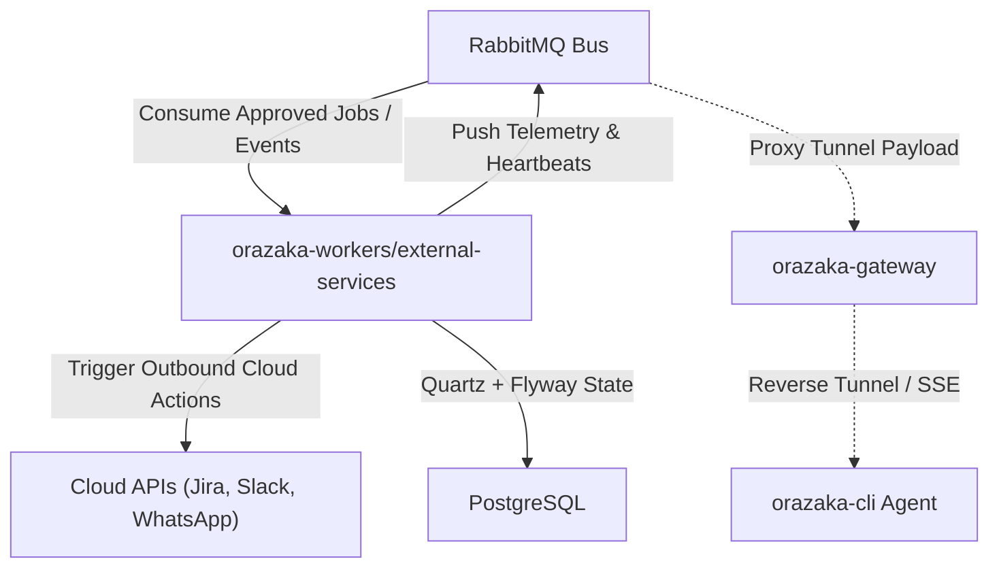
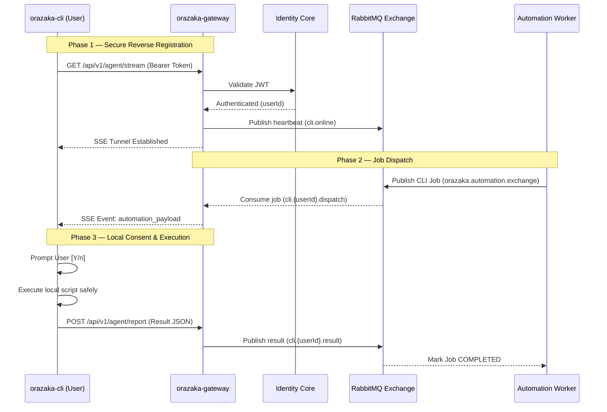

# Automation & Local Agent Protocol Specification

> Decoupled background execution worker (`orazaka-workers/external-services`) and the NAT-bypassing Local Agent Protocol.

---

## 1. Architectural Setup

- **Hexagonal Isolation**: The worker is fully isolated. It has zero dependency on `orazaka-gateway`.
- **Communication Invariant**: Inter-module sync is handled via the RabbitMQ broker.
- **Zero Inbound Ports**: The worker runs in a secure cluster mesh; the local CLI agent connects **outbound** to the gateway to fetch requests.

---

## 2. Quartz Scheduler
Automation scheduling states are persisted in the PostgreSQL database:
- **Quartz config**: `spring.quartz.job-store-type = jdbc` with postgres driver delegate.
- **Flyway Integration**: Flyway migrations are disabled on the worker.

---

## 3. Connectors & Log Stubs
The worker does not integrate with actual cloud APIs or Apache Camel routing. Instead:
- **Connector Dispatcher**: Outbound actions (Jira, Slack, Messenger, WhatsApp) are implemented as log-stubs in `ConnectorDispatcher.java` (`orazaka-apps/orazaka-workers/external-services/`).
- **Execution Logs**: Dispatching acts as a stub simulation logging payload metadata.
- **CLI Agent Routing**: If the type is `CLI_AGENT`, it correctly serializes and dispatches to RabbitMQ under the `cli.{userId}.dispatch` routing key for remote CLI execution.

---

## 4. Local Agent Protocol (Reverse SSE Tunneling)

- **Phase 1 (Registration)**: The CLI opens an SSE channel (`GET /api/v1/agent/stream`). Gateway registers the channel and broadcasts metadata.
- **Phase 2 (Dispatch)**: The automation worker posts a job payload (containing script and directory limits) to RabbitMQ. The Gateway consumes and proxies it via the SSE stream.
- **Phase 3 (Consent & Execution)**: The CLI agent prompts the user in the terminal (`Execute this action? [Y/n]`). If approved, the command runs and output is reported via `POST /api/v1/agent/report`.

---

## 5. Security & Isolation Matrix

- **NAT Bypassing**: SSE pulls commands outbound; no firewall inbound rules needed.
- **User Verification**: Interactive prompt confirmation `[Y/n]` blocks unapproved command runs.
- **Sandboxing**: Script actions restricted to user-configured directory lists.
- **Transport**: Secured with TLS. Timeout limits (default 300s) evict hung scripts.

---

## 6. RabbitMQ Topology

| Exchange | Type | Routing Key | Queue | Consumer |
| :--- | :--- | :--- | :--- | :--- |
| `orazaka.automation.exchange` | Topic | `job.approved` | `orazaka.automation.jobs` | Worker (`AutomationJobListener`) |
| `orazaka.automation.exchange` | Topic | `cli.{userId}.dispatch` | Per-User Dispatch | Gateway |
| `orazaka.automation.exchange` | Topic | `cli.{userId}.result` | Per-User Result | Worker (`AutomationJobListener`) |
| `orazaka.cli.exchange` | Fanout | `cli.online` | `orazaka.cli.heartbeat` | Gateway |
| `orazaka.identity.events` | Topic | `user.registered` | `orazaka.workers.identity.registration` | Worker (`IdentityNotificationListener`) |
| `orazaka.identity.events` | Topic | `password.reset` | `orazaka.workers.identity.password` | Worker (`PasswordNotificationListener`) |

---

## Related Documentation
- [Developer Onboarding Guide](101.md)
- [Architecture Reference](_generated/ARCHITECTURE.md)
- [CLI Reference](_generated/CLI.md)
- [ADR Indexes](_generated/ADRS.md)

